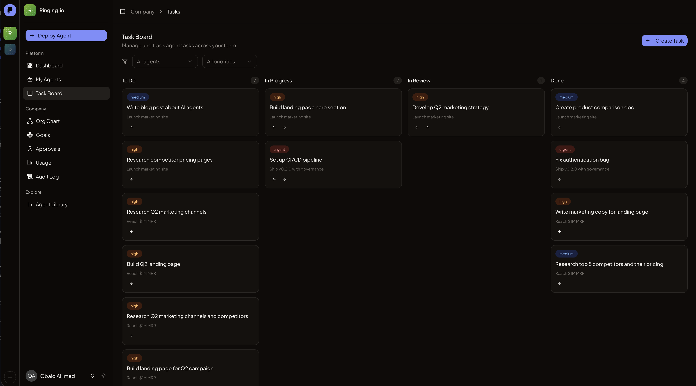
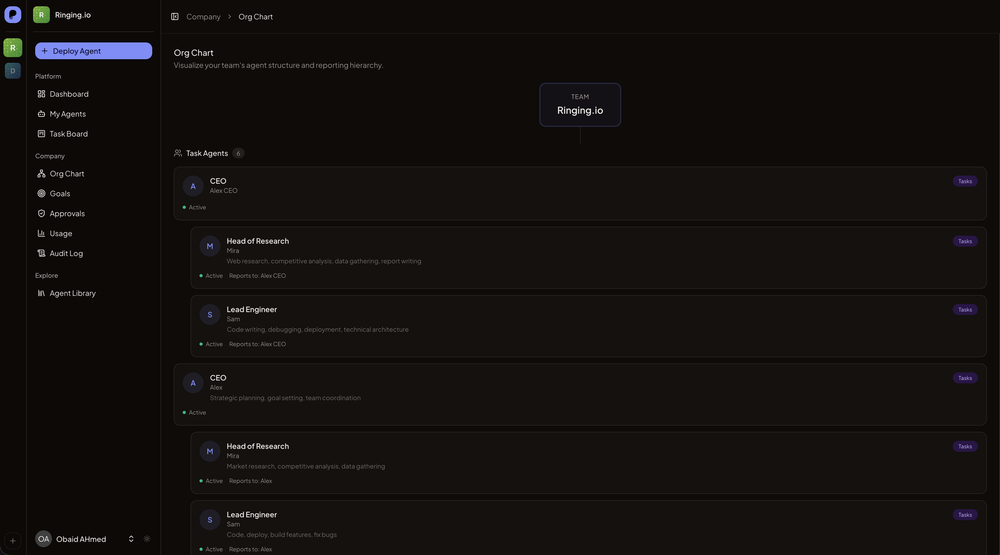
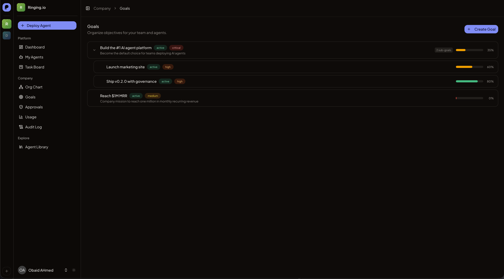
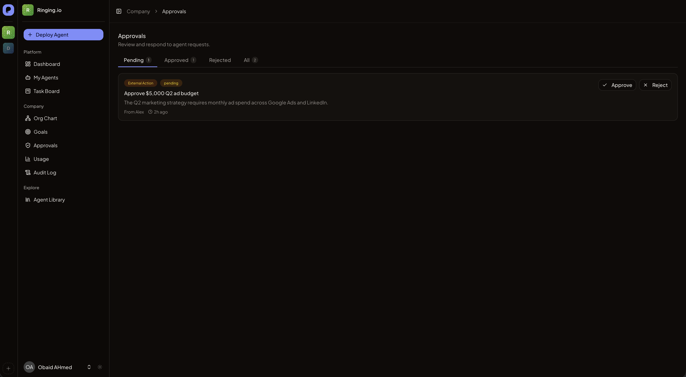

<p align="center">

```
 ____                  _     _
|  _ \ _ __ _____   _(_)___(_) ___  _ __
| |_) | '__/ _ \ \ / / / __| |/ _ \| '_ \
|  __/| | | (_) \ V /| \__ \ | (_) | | | |
|_|   |_|  \___/ \_/ |_|___/_|\___/|_| |_|
```

</p>

<p align="center">
  Open-source platform for deploying AI agents that work like employees.
</p>

<p align="center">
  <a href="#quick-start">Quick Start</a> &middot;
  <a href="#features">Features</a> &middot;
  <a href="https://provision.ai">Website</a> &middot;
  <a href="https://docs.provision.ai">Docs</a> &middot;
  <a href="https://discord.gg/W8rnGcvRCu">Discord</a>
</p>

<p align="center">
  <a href="https://github.com/provision-org/provision-core/stargazers"></a>
  &nbsp;
  <a href="LICENSE"></a>
  &nbsp;
  <a href="https://discord.gg/W8rnGcvRCu"></a>
  &nbsp;
  <a href="https://github.com/provision-org/provision-core/actions/workflows/tests.yml"></a>
</p>

---

## What is Provision

Provision lets you deploy AI agents that work for your company. Start simple with **chat agents** that join your Slack, Telegram, Discord, or web chat and respond to messages like any other team member. Or go further with **task agents** that work autonomously from a kanban board, organized in an org chart with managers, goals, and human approval gates. Everything is open source, self-hostable with Docker, and extensible through a plugin architecture. No vendor lock-in — run it on your own infrastructure or use [Provision Cloud](https://provision.ai) for managed hosting.

## Screenshots

<table>
  <tr>
    <td align="center">
      
      <br /><em>Task board with kanban columns</em>
    </td>
    <td align="center">
      
      <br /><em>Org chart with reporting hierarchy</em>
    </td>
  </tr>
  <tr>
    <td align="center">
      
      <br /><em>Goal hierarchy with progress tracking</em>
    </td>
    <td align="center">
      
      <br /><em>Approval inbox for agent decisions</em>
    </td>
  </tr>
</table>

## Quick Start

**Prerequisites:** [Docker Desktop](https://www.docker.com/products/docker-desktop/) installed and running.

```bash
git clone https://github.com/provision-org/provision-core.git && cd provision-core
cp .env.example .env
```

Add your OpenRouter key to `.env` (see [Configuration](#configuration) below), then:

```bash
docker compose up -d         # ~2 min on first run
```

Open **http://localhost:8000** &rarr; create an account &rarr; create a team &rarr; deploy your first agent.

<details>
<summary><strong>Run without Docker</strong> (PHP 8.3+, Node 22+, Redis)</summary>

```bash
composer install && npm install
cp .env.example .env
php artisan key:generate && php artisan migrate
php artisan db:seed --class=AgentTemplateSeeder
php artisan db:seed --class=TeamPackSeeder
composer run dev
```

You'll need Redis running locally for queues, cache, and sessions.

</details>

## Task Agents vs Chat Agents

Provision agents operate in one of two modes. You can mix both in the same team.

### Chat Agents

Chat agents live in your messaging channels. Connect one to **Slack**, **Telegram**, **Discord**, or the built-in **web chat** and it responds to messages, participates in threads, and can be mentioned like any colleague. Each agent gets its own Chrome browser, email identity, and workspace files.

**Best for:** customer support, Q&A, knowledge work, team communication.

```
User  →  Slack / Telegram / Discord / Web Chat
      →  Agent receives message
      →  Agent responds in thread
```

### Task Agents

Task agents work from the **task board** without waiting for a conversation. You create tasks, assign them to agents, and they execute autonomously. Agents are organized in an **org chart** with managers and direct reports. They pursue **goals** with measurable progress. High-stakes actions go through **approval gates** before executing.

**Best for:** engineering, research, operations, and anything that doesn't need a human in the loop.

```
User  →  Task Board (create task, assign agent)
      →  provisiond picks up task on agent server
      →  Agent executes autonomously
      →  Reports result back to Provision
```

### When to Use Which

| Scenario | Mode | Why |
|----------|------|-----|
| Answer customer questions in Slack | Chat | Conversational, needs channel presence |
| Fix a bug from a ticket | Task | Autonomous, reports result when done |
| Research competitors weekly | Task | Recurring, no human in the loop |
| Respond to inbound emails | Chat | Reactive, message-driven |
| Build a feature from a spec | Task | Multi-step, uses delegation to sub-agents |
| Team standup summaries | Chat | Needs access to channel history |

Most teams start with one or two chat agents, then add task agents as they discover work that doesn't need a human conversation to kick off.

## Features

### Agent Deployment
- **Server provisioning** — One-click setup on Docker, Hetzner, DigitalOcean, or Linode
- **Health monitoring** — Track agent status, uptime, and resource usage
- **Agent wizard** — 8-step creation flow: name, personality, model, channels, tools, and more
- **BYO cloud keys** — Teams bring their own cloud provider API keys

### Communication
- **Slack** — Agents appear as bot users in your workspace
- **Telegram** — Connect via bot token
- **Discord** — Full bot integration with thread support
- **Web Chat** — Built-in chat UI with SSE streaming, no third-party service needed

### Browser and Tools
- **Chrome per agent** — Each agent gets its own browser instance with a virtual display
- **VNC viewer** — Watch agents work in real time at `localhost:6080`
- **Workspace files** — Persistent file storage per agent
- **Memory browser** — Inspect and search an agent's memory from the web UI

### Task Orchestration
- **Kanban board** — Drag-and-drop task management with customizable columns
- **Atomic checkout** — Tasks are claimed with a lease to prevent double-execution
- **Delegation** — Agents can delegate sub-tasks to their direct reports
- **Task notes** — Agents attach structured notes and results as they work

### Company Structure
- **Org chart** — Visual hierarchy of agents with managers and reports
- **Goal tracking** — Define goals with measurable targets and track progress over time
- **Reporting hierarchy** — Managers review work and coordinate across their team

### Human Oversight
- **Approval gates** — Agents request human approval before taking high-stakes actions (deploying code, sending emails to customers, spending money)
- **Governance modes** — Choose per-team: `none` (full autonomy), `standard` (approve sensitive actions), or `strict` (approve everything)
- **Audit log** — Every agent action, approval decision, and task result is recorded with timestamps and context

### Task Daemon (provisiond)

Each agent server runs **provisiond**, a lightweight Node.js process that bridges the Provision dashboard with the agent runtime on the server. It polls for assigned tasks, builds structured prompts with task details and org context, sends them to the agent's LLM gateway, and reports results back. If a task fails, provisiond logs the error and moves on — one bad task never takes down the server.

### Open Source
- **MIT license** — Use it however you want
- **Plugin architecture** — Extend with Composer packages that implement module contracts
- **No artificial limits** — Self-hosted Provision is the full product, not a limited demo

## How It Works

### Architecture

```
┌─ app (Laravel) ──────────┐  ┌─ redis ─┐  ┌─ agent-runtime ──────────────┐
│  Web UI + API             │  │  Queues  │  │  Ubuntu 24.04                │
│  Reverb (WebSocket)       │  │  Cache   │  │  OpenClaw / Hermes           │
│  Horizon (Queue workers)  │  │  Sessions│  │  Chrome + VNC                │
│  Scheduler                │  │          │  │  provisiond v0.1.0           │
│  :8000                    │  │  :6379   │  │  :6080 (browser)             │
└───────────────────────────┘  └─────────┘  └──────────────────────────────┘
```

The **app** container runs the web UI, API, WebSocket server (Reverb), and queue workers (Horizon). The **agent-runtime** container runs the AI agents with Chrome for browser automation and provisiond for task orchestration. They communicate via `docker exec` locally or SSH for remote cloud servers.

### Agent Setup Flow

1. **Create a team** — pick a name, choose OpenClaw or Hermes
2. **Server provisioned** — Provision configures the agent runtime automatically
3. **Create an agent** — name, personality, model selection (8-step wizard)
4. **Connect a channel** — paste a Telegram bot token, Slack app, or Discord bot
5. **Agent goes live** — responds to messages, executes tasks, browses the web

## Configuration

### Required: OpenRouter API Key

Provision uses [OpenRouter](https://openrouter.ai) to give each team its own LLM access. You provide one management key, and Provision automatically creates isolated sub-keys per team.

1. Go to [openrouter.ai/keys](https://openrouter.ai/keys) and create a key
2. Add it to your `.env`:

```bash
OPENROUTER_PROVISIONING_API_KEY=sk-or-v1-your-key-here
```

**Why OpenRouter?** One key gives your agents access to Claude, GPT-4, Gemini, Llama, and 200+ other models. Provision creates a separate sub-key for each team so usage is isolated. You only pay for what your agents use — there are no Provision fees for self-hosted.

### Environment Variables

| Variable | Required | Default | Description |
|----------|----------|---------|-------------|
| `OPENROUTER_PROVISIONING_API_KEY` | **Yes** | — | Your OpenRouter management key. Provision creates per-team sub-keys from this. |
| `APP_KEY` | Auto | — | Generated automatically on first `docker compose up`. |
| `CLOUD_PROVIDER` | No | `docker` | Where agent servers run. `docker` for local, or `digitalocean`/`hetzner`/`linode` for cloud. |
| `ENABLE_CLOUD_PROVIDER_SELECTION` | No | `false` | Set to `true` to let users choose their cloud provider per team. |
| `BROADCAST_CONNECTION` | No | `reverb` | WebSocket driver. Reverb is included and runs automatically in Docker. |
| `REVERB_APP_KEY` | No | `local` | Reverb app key for WebSocket authentication. |
| `REVERB_PORT` | No | `8085` | Port for the Reverb WebSocket server. |
| `DIGITALOCEAN_API_TOKEN` | No | — | Required if using DigitalOcean for agent servers. |
| `HETZNER_API_TOKEN` | No | — | Required if using Hetzner for agent servers. |
| `LINODE_API_KEY` | No | — | Required if using Linode for agent servers. |
| `MAIL_MAILER` | No | `log` | Set to `smtp`/`ses`/`postmark` for real email delivery. |

### What Happens on First Run

When you run `docker compose up -d`, the app container:

1. Installs PHP and Node dependencies
2. Generates an encryption key (if not set)
3. Creates the SQLite database and runs migrations
4. Seeds agent templates and team packs (pre-built agents you can hire in one click)
5. Builds the frontend assets (React + Vite)
6. Starts the web server, queue worker (Horizon), WebSocket server (Reverb), and scheduler

The agent-runtime container starts separately with Chrome, OpenClaw or Hermes, provisiond, and a VNC server.

**First run takes ~2 minutes.** Subsequent starts are faster since dependencies and assets are cached.

## Agent Frameworks

Each team chooses an agent framework during setup:

- **[OpenClaw](https://openclaw.ai)** — Browser-first agents. Best for web research, form filling, data extraction, and tool-heavy workflows. Agents get a full Chrome browser and can navigate, click, type, and extract data from any website.

- **[Hermes](https://github.com/NousResearch/hermes-agent)** — Reasoning-first agents. Best for analysis, writing, planning, and conversation. Hermes agents excel at multi-step reasoning and producing structured output.

Both frameworks expose a local gateway API that provisiond and the chat system use to send prompts and receive responses. You can switch frameworks per team — they share the same infrastructure.

## Deploy to Production

When you're ready for 24/7 agents, connect a cloud provider:

```bash
# In your .env
CLOUD_PROVIDER=hetzner          # or digitalocean, linode
HETZNER_API_TOKEN=your-key      # Provision handles the rest
```

Or set `ENABLE_CLOUD_PROVIDER_SELECTION=true` to let each team choose their own provider in the UI.

Create an agent in the UI and Provision will automatically provision a server, install the agent framework, configure provisiond, set up channels, and deploy your agent. One click.

## Self-Hosted vs Provision Cloud

|  | Self-Hosted (Free) | Cloud | Enterprise |
|--|---------------------|-------|------------|
| **Price** | Free, forever | From $49/mo | Custom |
| **Infrastructure** | Docker or BYO cloud | Fully managed | Managed or on-prem |
| **Updates** | `git pull && docker compose up` | Automatic | Automatic |
| **Email identities** | — | MailboxKit included | MailboxKit included |
| **Residential proxy** | — | Browser Pro included | Browser Pro included |
| **Skill packs** | — | Pre-built skill library | Custom skill library |
| **Analytics** | — | Token usage & performance dashboards | Advanced reporting |
| **Support** | Community (Discord, GitHub) | Email support | Dedicated support + SLA |

Self-hosted Provision is the full product, not a limited demo. It's the same core that powers Provision Cloud — Cloud and Enterprise add managed infrastructure and premium modules on top.

<p align="center">
  <a href="https://provision.ai"><strong>Try Provision Cloud &rarr;</strong></a>
</p>

## Extend with Modules

The core handles agent deployment, channels, tasks, governance, and infrastructure. Modules add more capabilities through a clean plugin interface.

Building your own module? See [`app/Contracts/Modules/`](app/Contracts/Modules/) for the interfaces your module can implement:

- `ModuleContract` — Base interface (name, capabilities, install scripts, cleanup)
- `BillingProvider` — Subscription checks and agent limits
- `AgentEmailProvider` — Email provisioning and inbox access
- `AgentProxyProvider` — Proxy configuration
- `AgentBrowserProvider` — Browser URL generation

Modules register via Laravel package discovery. The core checks `app()->bound(ContractClass::class)` before using any module feature, so everything degrades gracefully.

## Tech Stack

- **Backend:** PHP 8.3, Laravel 12, Inertia.js v2
- **Frontend:** React 19, TypeScript 5.7, Tailwind CSS v4
- **Agent Frameworks:** OpenClaw, Hermes
- **Orchestration:** provisiond (Node.js daemon)
- **Real-time:** Laravel Reverb (WebSocket)
- **Infrastructure:** Docker, Hetzner, DigitalOcean, Linode
- **Database:** SQLite (dev) / MySQL (production)

## Troubleshooting

**`docker compose up` is slow on first run**
First run installs dependencies and builds frontend assets (~2 min). Subsequent starts reuse cached assets and start in seconds.

**Agent deployment fails**
Check Horizon logs: `docker compose logs app | grep horizon`. Common causes:
- Missing `OPENROUTER_PROVISIONING_API_KEY` in `.env`
- Agent-runtime container not running: `docker compose ps`

**VNC viewer shows blank screen**
The display starts empty. Chrome launches when an agent uses browser automation. You can also open `http://localhost:6080` directly.

**APP_KEY errors after restart**
If you see "MAC is invalid" errors, your `APP_KEY` changed between runs. Set a permanent key in `.env`: `php artisan key:generate`

**Governance pages not showing**
The Company section (org chart, goals, approvals) appears in the sidebar for all teams. If you don't see it, make sure you're on the latest migration: `docker compose exec app php artisan migrate`.

**provisiond not starting**
Check the daemon log inside the agent-runtime container: `docker compose exec agent-runtime cat /var/log/provisiond.log`. Common causes:
- Missing daemon token — the app generates this during server provisioning
- Agent-runtime container not fully started — wait for the health check to pass

## Contributing

We welcome contributions. See [`CONTRIBUTING.md`](CONTRIBUTING.md) for setup instructions.

Areas we'd love help with:
- New cloud provider integrations (AWS, GCP, Azure)
- New channel integrations (WhatsApp, Microsoft Teams)
- New agent framework drivers
- Task board improvements and workflow templates
- Governance features and approval policies
- Documentation and examples

## Community

- [Discord](https://discord.gg/W8rnGcvRCu) — Ask questions, share what you're building
- [GitHub Issues](https://github.com/provision-org/provision-core/issues) — Bug reports and feature requests
- [Twitter/X](https://x.com/tryprovision) — Updates and announcements

## License

MIT License. See [LICENSE](LICENSE) for details.

---

<p align="center">
  If Provision helps you, consider giving it a star. It helps others discover the project.
</p>

<p align="center">
  <a href="https://github.com/provision-org/provision-core/stargazers"></a>
</p>
